# ✨ 취업하Job – 당신의 AI 취업 도우미

> **Django 기반 통합 취업 지원 웹서비스**  
> 자기소개서 생성부터 채용 공고 추천까지, AI가 당신의 취업 여정을 함께합니다.

---

## 👥 팀 소개

<table>
  <tr>
    <td align="center" width="150">
      <a href="https://github.com/juyeonkwon">
        <br/>
        <strong>권주연</strong><br/><sub>[팀장]</sub><br/><code>@juyeonkwon</code><br/>
      </a>
    </td>
    <td align="center" width="150">
      <a href="https://github.com/solchna">
        <br/>
        <strong>조솔찬</strong><br/><code>@solchna</code><br/>
      </a>
    </td>
    <td align="center" width="150">
      <a href="https://github.com/asdg441">
        <br/>
        <strong>노건우</strong><br/><code>@asdg441</code><br/>
      </a>
    </td>
    <td align="center" width="150">
      <a href="https://github.com/dahyun11">
        <br/>
        <strong>하다현</strong><br/><code>@dahyun11</code><br/>
      </a>
    </td>
    <td align="center" width="150">
      <a href="https://github.com/jeong-mincheol">
        <br/>
        <strong>정민철</strong><br/><code>@jeong-mincheol</code><br/>
      </a>
    </td>
    <td align="center" width="150">
      <a href="https://github.com/AQUAQUA5">
        <br/>
        <strong>오원장(실종)</strong><br/><code>@AQUAQUA5</code><br/>
      </a>
    </td>
  </tr>
</table>


---

## 📌 프로젝트 개요

| 항목 | 내용 |
|------|------|
| 🏷️ 프로젝트명 | **취업하Job (SKN15 4th 2팀)** |
| 🗓️ 기간 | **2025.09.15 ~ 2025.09.16** |
| 🎯 목적 | 사용자 스펙 기반 채용 공고 추천 + 인재상 기반 자기소개서 자동 생성 및 첨삭 |
| 🔧 방식 | Django 웹 + LLM 기반 분석 및 비동기 크롤링 시스템 |
| 📈 기대 효과 | 반복 작업 자동화, 자기소개서 품질 향상, 사용자 경험 개선 |

---

## 🧠 주요 기능

| 기능 | 설명 |
|------|------|
| 🔍 **공고 추천** | 사용자 스펙 입력 → LLM 분석 → 키워드 확장 → Playwright로 채용공고 크롤링 |
| ✍️ **자기소개서 생성** | 기업 인재상, 자소서 예시, 사용자 스펙 기반 자소서 초안 자동 생성 |
| 🪄 **자기소개서 첨삭** | 톤, 분량, 내용 적합성 중심의 AI 피드백 제공 |
| ⚡ **빠른 유사도 검색** | SentenceTransformer + FAISS 기반 스펙 유사도 검색 지원 |
| 🖥 **웹 UI** | Django 기반 사용자 친화적 웹 인터페이스 제공 |

---

## 🏗️ 시스템 구성도

```mermaid
flowchart TD
    A[사용자 입력] --> B{의도 분류}

    %% 분기 1: 자기소개서 생성
    B -->|자기소개서 생성| C[자기소개서 생성]
    C --> C1[기업/직무/스펙 추출]
    C1 --> C2[인재상/예시 기반 생성]
    C2 --> C3[LangGraph 첨삭 루프]
    C3 --> E[결과 출력]

    %% 분기 2: 공고 추천
    B -->|공고 추천| D[공고 추천]
    D --> D1[LLM 기반 키워드 추출]
    D1 --> D2[키워드 확장 → 크롤링]
    D2 --> D3[조건별 공고 추천 출력]
    D3 --> E

    %% 분기 3: 자기소개서 피드백
    B -->|자기소개서 피드백| F[자기소개서 피드백]
    F --> F1[LLM API 호출 &#40;피드백&#41;]
    F1 --> F2[피드백 결과 반환]
    F2 --> F3[피드백 결과 DB 저장]
    F3 --> E

    %% 출력
    E --> G[Django 웹 UI 표시]
``` 



---

## ⚙️ 기술 스택

### 📌 전체 스택 요약

| 영역                   | 기술 스택 뱃지                                                                                                                                                                                                                                                                                                                                                                                                                                                                                                              |
| -------------------- | --------------------------------------------------------------------------------------------------------------------------------------------------------------------------------------------------------------------------------------------------------------------------------------------------------------------------------------------------------------------------------------------------------------------------------------------------------------------------------------------------------------------- |
| 🖥 **Backend / LLM** |          |
| ☁️ **Infra / DevOps** |    |
| 🨠**Frontend**      |                                                                                                                     |
| ⚡ **크롤링 / 비동기**      |                                                                                                                   |
| 🔠**ì연어처리 / 검색**    |                                                                                                                                                                                                                                |
| 🗄 **Database** |   |
                                                                                                                                                                                                                                                                                                    |

---

## 📂 디렉토리 구조

```plaintext
skn15-4th-2team/
├── app_logic/         # 챗봇 및 주요 로직
├── jobkorea_cli/      # 잡코리아 크롤러, LLM 분석기
├── myapp/             # Django 앱 (URL, View, Template)
├── myproject/         # Django 프로젝트 설정
├── src/               # 상태 관리, 그래프, 크롤링 유틸
├── utils/             # 커버레터/공고 관련 모듈
├── .env               # 환경 변수
├── manage.py          # Django 명령어 진입점
├── requirements.txt   # 패키지 목록
└── README.md          # 설명서
```

---

## 🚀 실행 방법

### 1. 환경 설정

**`.env`** 파일을 생성하고 아래와 같이 환경 변수를 입력:
```env
OPENAI_API_KEY=your-api-key
CHAT_URL=https://your-llm-endpoint.com
```

### 2. 패키지 설치

필요한 패키지를 설치합니다:
```
pip install -r requirements.txt
```
### 3. 데이터베이스 마이그레이션
Django 프로젝트의 초기 마이그레이션을 실행:
```
python manage.py migrate
```

### 4. 서버 실행
Django 개발 서버를 실행:
```
python manage.py runserver
```
---

## 🖥️ 데모 화면 예시

<table>
  <tr>
    <td align="center">
      
      <br/><sub><b>공고 검색 화면</b></sub>
    </td>
    <td align="center">
      
      <br/><sub><b>자소서 평가 피드백</b></sub>
    </td>
  </tr>
  <tr>
    <td align="center">
      
      <br/><sub><b>자소서 작성 페이지</b></sub>
    </td>
    <td align="center">
      
      <br/><sub><b>자소서 생성 결과</b></sub>
    </td>
  </tr>
</table>


| 기능               | 화면 설명                                                                 |
|--------------------|----------------------------------------------------------------------------|
| 🔍 공고 탐색        | 사용자 스펙 입력 → 키워드 분석 → Playwright 기반 공고 크롤링 결과 출력     |
| ✍️ 자소서 생성       | 기업명, 직무, 스펙 입력 → 자소서 문항 자동 추출 및 맞춤형 초안 생성         |
| 🪄 자소서 첨삭       | 생성된 자소서를 기반으로 톤, 분량, 표현력에 대한 AI 피드백 제공             |
| 🔄 반복 피드백 루프 | 첨삭 → 반영 → 재첨삭 과정을 통해 자소서 퀄리티 지속 개선                    |
| 🌐 웹 UI           | Django 기반 프론트엔드로 사용자 친화적 입력 및 결과 출력 제공                |

---

## 📈 기대 효과

| 항목            | 효과 설명                                                               |
|-----------------|-------------------------------------------------------------------------|
| ⏱️ 시간 절약     | 반복적인 공고 탐색 및 자소서 작성을 자동화하여 취업 준비 효율성 향상        |
| 🎯 정확성 향상   | 기업 인재상 기반 자소서 작성으로 기업 맞춤화, 합격 가능성 제고               |
| 🔁 품질 향상     | 첨삭 루프를 통해 문장력, 표현력, 직무 적합성 등을 지속적으로 개선           |
| 🖥 쉬운 사용성   | Django 기반 UI로 기술 지식 없이도 누구나 쉽게 사용 가능                     |

---

## 📁 참고 사항

- `.env` 파일에 OpenAI 키, 외부 API 주소 등 환경 변수 설정 필요
- 크롤링 과정은 Playwright를 기반으로 하며, 초기 실행 시 헤드리스 설정 권장
- LLM 응답은 `.cache_llm/` 경로에 저장되며 중복 요청 방지를 위해 캐싱 처리됨
- 세부 로직은 각 디렉토리(`jobkorea_cli/`, `app_logic/`, `utils/` 등) 내 주석 및 문서 참고

